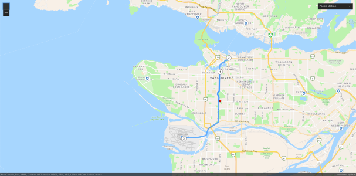

# JavaScript demo using Vite bundler

This demo project will use ArcGIS API for JavaScript with Vite to produce a browser app and using ArcGIS API key authentication. This demo is based on [Route and directions](https://developers.arcgis.com/documentation/mapping-apis-and-services/routing/route-and-directions/) because I wanted to show how to use an API key with ArcGIS location services without turning on pay-as-you-go.

This app also demonstrates how to use ESM, or [JavaScript Modules](https://developer.mozilla.org/en-US/docs/Web/JavaScript/Guide/Modules) in a very simple and easy to use Node.js project. This project uses ArcGIS API keys to demonstrate how to authenticate [ArcGIS Platform location services](https://developers.arcgis.com/documentation/mapping-apis-and-services/services/) in a simple way for client apps.

There are a lot of good programing practices preferring modules over traditional `<script>` tags. This project tries to demonstrate that while most of the [ArcGIS Platform examples](https://developers.arcgis.com/javascript/latest/display-a-map/) use `<script>` tags for simplicity. To learn more, see [Why use modules instead of script tags](https://hacks.mozilla.org/2015/08/es6-in-depth-modules/). This same [demo code](https://developers.arcgis.com/documentation/mapping-apis-and-services/routing/route-and-directions/) is available without ESM modules.

Also for simplicity, I chose to use [Vite](https://vitejs.dev/guide/) for the module bundler. This was a recommendation from [@odoe](https://github.com/odoe) and [@hhkaos](https://github.com/hhkaos) that actually turned out to work. Vite is the least amount of friction and learning of all the many [options for module bundling](https://openbase.com/categories/js/best-javascript-bundler-libraries).

## Installation

1. Clone or fork this repository and `cd` into the `JavaScript/esm-api-key-demo`, or copy all the files in `JavaScript/esm-api-key-demo` into a new folder.
2. Install the dependencies:

```bash
npm install
```

3. Go to your [developer dashboard](https://developers.arcgis.com/api-keys) and copy your API key.
    - if you do not have an ArcGIS Developer account you can [create on for free](https://developers.arcgis.com/sign-up).
    - you can use the default API key or create a new one. Make sure the `basemaps`, `geocoding (not stored)`, and `routing` scopes are set.

4. Rename `secret.sample.js` to `secret.js`. Edit this file and replace `YOUR_API_KEY` with your API key.

```javascript
export const apiKey = "YOUR_API_KEY";
```

5. Run the app:

```bash
npm start
```

This will start the local development server and indicate the URL of your app:

```txt
vite vx.x.x dev server running at:

  > Local: http://localhost:3000/
```

Open a web browser at that URL to display your app.



### Development

All of the JavaScript code is in `index.js`. When the dev server is running, the page will reload anytime you save changes to the file. It will also observe changes to `index.html` and `index.css`.

### Troubleshooting

If the app does not work then these are the most common issues:

* If the app runs but the map does not show then your API key is probably incorrect.
* If the map shows but you cannot perform routing then your API key is missing the routing scope.

## Start from scratch

If you wanted to build this project from scratch the following are the steps I used to build this app:

### Create a map project

1. Create a new folder and create a new node project:

```bash
mkdir vite-demo
cd vite-demo
npm init
```

2. Install dependencies for [Vite](https://vitejs.dev/guide/) and [ArcGIS API for JavaScript](https://developers.arcgis.com/javascript/latest/):

```bash
npm install --save-dev vite
npm install @arcgis/core@next
```

3. Create `index.html`:

```html
<!DOCTYPE html>
<html lang="en">
<head>
    <meta charset="utf-8">
    <meta name="viewport" content="initial-scale=1, maximum-scale=1, user-scalable=no">
    <title>ArcGIS Map with JavaScript</title>
    <link rel="stylesheet" type="text/css" href="index.css" />
</head>
<body>
  <div id="appDiv"></div>
  <script type="module" src="/index.js"></script>
</body>
</html>
```

Note the `script type="module"`. This is important when using ESM modules. The script will not load without it.

4. Create `index.css`:

```css
@import "https://js.arcgis.com/4.21/@arcgis/core/assets/esri/themes/dark/main.css";

html,
body,
#appDiv {
    padding: 0;
    margin: 0;
    height: 100%;
    width: 100%;
}
```

5. Create `index.js`:

```javascript
import esriConfig from "@arcgis/core/config";
import Map from "@arcgis/core/Map";
import MapView from "@arcgis/core/views/MapView";

const map = new Map({
    basemap: "arcgis-topographic"
});

const mapView = new MapView({
    map,
    container: "appDiv",
    center: [-118.805, 34.027],
    zoom: 13
});
```

6. Go to your developer dashboard at https://developers.arcgis.com/dashboard, copy your default API key or create a new one and copy it. Create `secret.js` file to hold your API key. Create a `.gitignore` file and add `secret.js` to it so that you do not commit this file to version control.

Create `secret.js`

```javascript
export const apiKey = "YOUR_API_KEY";
```

Create `.gitignore`

```ini
secret.js
```

7. Update `index.js` to get your API key from the secrets:

```javascript
import esriConfig from "@arcgis/core/config";
import Map from "@arcgis/core/Map";
import MapView from "@arcgis/core/views/MapView";
import { apiKey } from "./secret";

esriConfig.apiKey = apiKey;
```

8. Update package.json

```json
  "main": "index.js",
  "scripts": {
    "dev": "vite",
    "build": "vite build",
    "serve": "vite preview",
    "start": "vite"
  },
```

9. You are now ready to build and run the project.

```bash
npm run dev
```

when the build is complete Vite will display a message on the console:

```bash
  vite v2.5.0 dev server running at:

  > Local: http://localhost:3000/
```

Open a browser to `http://localhost:3000/` and observe your map.
