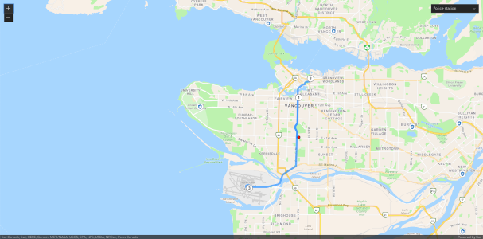

# JavaScript demo using application token authentication

This project will demonstrate how to use [ArcGIS application credentials](https://developers.arcgis.com/documentation/mapping-apis-and-services/security/application-credentials/) with your [ArcGIS API for JavaScript](https://developers.arcgis.com/javascript/latest/) app. Application credentials provide different advantages when compared with API keys and OAuth user login authentication:

1. Application credentials will require a server process to negotiate credentials with an ArcGIS server. Is is considered insecure and highly risky to embed your app credentials in a client app, as your credentials could easily be hijacked. For some workflows, adding a server component adds a significant amount of complexity to building, testing, and deploying your app.
2. Application credentials are short-lived tokens, expiring at most in 2 weeks, and require refreshing. API keys never expire.
3. Application credentials are considered more secure than API keys since the client app must request a token from your server when needed and that token will expire and require refreshing on the server. Since API keys never time out and you embed them in your client app, if they are compromised your only recourse is to revoke the API key, generate a new one, and rebuild and deploy your app with the new key.
4. Application credentials scope to all of the read-access privileges of the application owner. API keys can be scoped to specific services.
    - When using an ArcGIS Platform or ArcGIS Developer account, an application credential may access private hosted feature layers owned by the account.
    - When using an ArcGIS Online account, an application credential may not be used to access private hosted feature layers.
5. You cannot use application credentials to create or update content.

This project is the same demo as [ESM API key demo](../esm-api-key-demo/) only using application credentials to authenticate instead of API keys. This project also requires a server. I provided two implementations: one using [Node.js app-token-server-demo](../../node-js/app-token-server-demo/) and another with [PHP app-server-token-demo](../../php/app-token-server-demo/).
This project uses [Axios](https://axios-http.com/) as the HTTP client to request the token from the server, but leaves some specific application framework security issues open as they are beyond the scope of this particular demonstration.

## Create your registered application

Go to your [developer dashboard](https://developers.arcgis.com/applications) and get your app's **client ID** and **client secret**.

- If you do not have an ArcGIS Developer account you can [create on for free](https://developers.arcgis.com/sign-up).
- If you have an existing OAuth 2.0 app definition you can use it. Otherwise create a new application and save it. Update the server app configuration with your **client ID** and **client secret**.
- To learn more about application registration, [visit the tutorial](https://developers.arcgis.com/documentation/mapping-apis-and-services/security/tutorials/register-your-application/).
- There are more instructions in the server app README.

## Run the server

Follow the instructions to install and run one of the server apps:

* [Node.js app-token-server-demo](../../node-js/app-token-server-demo/)
* [PHP app-server-token-demo](../../php/app-token-server-demo/)

## Installation

1. Clone or fork this repository and `cd` into the `JavaScript/esm-app-token-demo`, or copy all the files in `JavaScript/esm-app-token-demo` into a new folder.
2. Install the dependencies:

```bash
npm install
```

3. Open `index.js` in your editor. Update the token URL to the location you are running the token server.

```javascript
const appTokenURL = "http://localhost:3080/auth"; // The URL of the token server
```

4. Run the app.

```bash
npm start
```

Open a web browser to the location indicated on the console:

```txt
vite vx.x.x dev server running at:

  > Local: http://localhost:3000/
```

Open a web browser at that URL to display your app.



## Troubleshooting

A lot can go wrong with this demo, it requires a lot of things to work exactly right.

1. Verify the server app is running and is able to generate tokens. Check to make sure the **client ID** and **client secret** are set to your application properties.
2. Check to make sure the server is running at the URL you think it is and the client app can connect to that URL. You can try a tool like Postman to test the connection and that the server is responding.
3. If the app runs but the map does not show then your token server is not working or it is not able to generate valid tokens.
4. If the map shows but you cannot perform routing, then your ArcGIS user account does not have sufficient privileges to perform this service.
