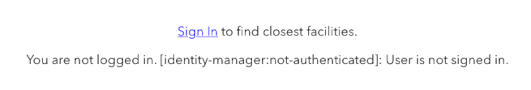

# JavaScript demo using OAuth 2.0 and ArcGIS Identity

This project will demonstrate how to use [ArcGIS identity with OAuth 2.0](https://developers.arcgis.com/documentation/mapping-apis-and-services/security/oauth-2.0/) with an [ArcGIS API for JavaScript](https://developers.arcgis.com/javascript/latest/) app. ArcGIS identity provides different advantages when compared with API keys and application credentials authentication:

1. A user login with OAuth 2.0 is considered the most secure of the [three ArcGIS authentication techniques](https://developers.arcgis.com/documentation/mapping-apis-and-services/security/#authentication-methods).
2. OAuth 2.0 is well seasoned and universally implemented by most PaaS and SaaS platforms.
3. It requires the user to log in with an ArcGIS account (ArcGIS Platform, ArcGIS Online, or ArcGIS Enterprise), and that account has the required privileges to access the location services of the app.
4. There are no secrets or personally identifiable information stored in the client app.

This project is the same demo as [ESM API key demo](../esm-api-key-demo/) only using user credentials to authenticate instead of API keys. To understand how this app was developed using ES modules, review the [README](../esm-api-key-demo/) for that project. I will only cover the differences here.

## Installation

1. Clone or fork this repository and `cd` into the `JavaScript/esm-user-login-demo`, or copy all the files in `JavaScript/esm-user-login-demo` into a new folder.
2. Install the dependencies:

```bash
npm install
```

3. Go to your [developer dashboard](https://developers.arcgis.com/applications) and get your app's **client ID**.
    - If you do not have an ArcGIS Developer account you can [create on for free](https://developers.arcgis.com/sign-up).
    - If you have an existing OAuth 2.0 app definition you can use it. Otherwise create a new application and save it. Copy the **client ID**. NOTE: you will also need to update the **Redirect URLs** section to add a redirect URL to your running app. We will go over that in a later step.
    - To learn more about application registration, [visit the tutorial](https://developers.arcgis.com/documentation/mapping-apis-and-services/security/tutorials/register-your-application/).

4. Rename `secret.sample.js` to `secret.js`. Edit this file and replace `YOUR_CLIENT_ID` with your **client ID**.

```javascript
export const clientID = "YOUR_CLIENT_ID";
```

5. Run the app.

```bash
npm start
```

Open a web browser to the location indicated on the console:

```txt
vite vx.x.x dev server running at:

  > Local: https://localhost:3000/
```

At this point note the URL you app is running at and copy it. In this case it is `https://localhost:3000/` (it could be different on your computer.) This is your _redirect URI_ that you will need in order to complete the OAuth 2.0 login process.

6. OAuth 2.0 requires the authentication server to return to a registered redirect URL. Return to your [developer dashboard](https://developers.arcgis.com/applications) application definition and click **Edit application**.
    - In the **Redirect URLs** section, click **+ Add URI**.
    - Enter your app's URL copied from above, and then click **Add URI**.
    - You may need to wait a few seconds for the server to update your app definition.

7. Return to your browser with the app running. It should show a link to log in.



Clicking the link redirects to an ArcGIS login screen running at arcgis.com. This screen may show different information depending on your logged in state.


After you log in and authorize the app, it should redirect back to your redirect URL set in a prior step. When it does this redirect the app will recognize the logged in user and render the map.


The significant feature of this app is using ArcGIS API for JavaScript [IdentityManager](https://developers.arcgis.com/javascript/latest/api-reference/esri-identity-IdentityManager.html) class to determine the user's logged in state and update the UI accordingly. When it detects a logged in user it renders the map using that user's authentication. When no one is logged in it renders the logged out state and displays a sign in prompt.

```javascript
    IdentityManager.checkSignInStatus(oauthInfo.portalUrl + "/sharing")
    .then(function(userCredential) {
        document.getElementById("userId").innerText = userCredential.userId;
        document.getElementById("personalizedPanel").style.display = "block";
        setupMapView();
    })
```
